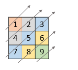

# PROBLEM STATEMENT

Given a 2D integer array nums, return all elements of nums in diagonal order as shown in the below images.

# EXAMPLE

    Input: nums = [[1,2,3],[4,5,6],[7,8,9]]
    Output: [1,4,2,7,5,3,8,6,9]

# APPROACH

Let's take an example.

	nums = [[1,2,3],[4,5,6],[7,8,9]]
	
	Here, if we see how the groups are formed
	
	Group 1 -> 1
	Group 2 -> 4,2
	Group 3 -> 7,5,3
	Group 4 -> 8,6
	Group 5 -> 9
	
	Let's take individual groups and see if we can find any pattern.
	
	For group 1, the only element is "1" which has row = 0 and col = 0
	
	In group 2, there are two elements
		1. "4" with row = 1 and col = 0
		2. "2" with row = 0 and col = 1

    In group 3, there are three elements
		1. "7" with row = 2 and col = 0
		2. "5" with row = 1 and col = 1
		3. "3" with row = 0 and col = 2

    In group 4, there are two elements
		1. "8" with row = 2 and col = 1
		2. "6" with row = 1 and col = 2

     In group 5, there is only one element "9" with row = 2 and col = 2
	 
	 Did you notice some pattern?
	 
	 For any particular group, all elements in that group have the same row + col value.
	 
	 For example, 
		 For group 1, row+col = 0
		 For group 2, row+col = 1
		 For group 3, row+col = 2
		 For group 4, row+col = 3
		 For group 5, row+col = 4
		 
# **MINHEAP APPROACH**
		 
So, we now know that we can group those elements together that have the same row + col value. And when we return the data, we have to return the list in the order of smallest "row + col" value to the largest.

So, as we traverse the 2D array and find the row + col value for each number, we want a data structure that can order that number based on its row + col value from smallest to largest.

A minHeap will be an appropriate solution here. But, there is one issue. As we see in the diagram, we have to traverse diagonally. It means, in an individual group, the elements are not ordered from smallest to largest or largest to smallest. But, they are ordeerd by their row number from largest to smallest.

	Take the group 3 for example -> 7,5,3
	
	7 is first and its row = 2
	5 is second and its row = 1
	3 is third and its row = 0
	
 It means, as we put items in our minHeap, if two elements have the same row + col value, we want the element with a higher row number to be placed on top of the element with a lower row number.
 
 And for that, we can push a tuple with three values into the minHeap. As we know, in Python, the minHeap orders elements by the first tuple value. But, if there is a tie, we can use a tuple with three items so that Python uses the second item for breaking the tie. 
 
 We want the elements with the same row+col value to be ordered such that the element with a higher row number is placed on top of the element with a lower row number. That's why, in the code, the second tuple value we passed is the row number but in negative.
 
 Why in negative? 
 
 Suppose we have two elements with same row + col value in row 4 and row 1 respectively. 4 > 1 so if second value of the tuple is a positive row number, minHeap will place the element at row 1 above the element at row 4. But, if we turn the row number to a negative value, it will do the opposite because -4 < -1. 

# **LIST OF LISTS APPROACH**
The only reason to use a heap is so that elements with same row + col value are grouped together in the order of their row numbers from largest to smallest.

But, we can do the same using a simple 2D list such that each index has a list which represents a group. 

As we will traverse from first to last row, the elements in each group will be ordered by their row numbers from smallest to largest. But since we want the opposite, we can utilize the "pop" method when we fill the output list.
