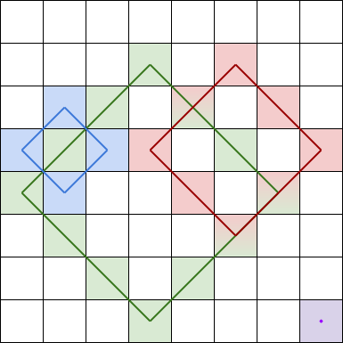
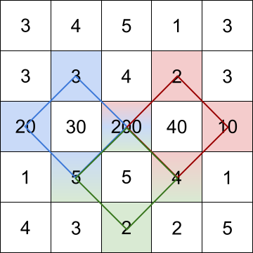

# PROBLEM STATEMENT

You are given an m x n integer matrix grid​​​.

A rhombus sum is the sum of the elements that form the border of a regular rhombus shape in grid​​​. The rhombus must have the shape of a square rotated 45 degrees with each of the corners centered in a grid cell. 

Below is an image of four valid rhombus shapes with the corresponding colored cells that should be included in each rhombus sum:

Note that the rhombus can have an area of 0, which is depicted by the purple rhombus in the bottom right corner.

Return the biggest three distinct rhombus sums in the grid in descending order. If there are less than three distinct values, return all of them.

# EXAMPLE

    Input: grid = [[3,4,5,1,3],[3,3,4,2,3],[20,30,200,40,10],[1,5,5,4,1],[4,3,2,2,5]]
    Output: [228,216,211]

Explanation: The rhombus shapes for the three biggest distinct rhombus sums are depicted above.
- Blue: 20 + 3 + 200 + 5 = 228
- Red: 200 + 2 + 10 + 4 = 216
- Green: 5 + 200 + 4 + 2 = 211

# APPROACH

A Brute Force solution will work since the row and column count won't be more than 50. So, in the most extreme case, we will have a matrix with 50 rows and 50 columns.

BTW you can optimize this solution further if we pre-compute the diagonal sum between the corners. In that case, we would get the sum between two indices in O(1) time (But that would be too much work xD)
