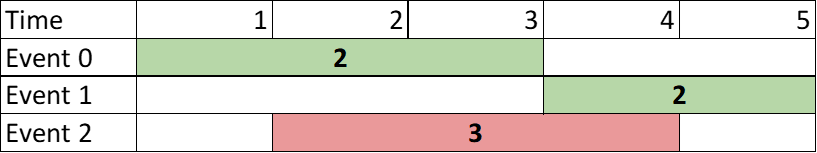

# PROBLEM STATEMENT

You are given a 0-indexed 2D integer array of events where events[i] = [startTimei, endTimei, valuei]. The ith event starts at startTimei and ends at endTimei, and if you attend this event, you will receive a value of valuei. You can choose at most two non-overlapping events to attend such that the sum of their values is maximized.

Return this maximum sum.

Note that the start time and end time is inclusive: that is, you cannot attend two events where one of them starts and the other ends at the same time. More specifically, if you attend an event with end time t, the next event must start at or after t + 1.

# EXAMPLE

    Input: events = [[1,3,2],[4,5,2],[2,4,3]]
    Output: 4

Explanation: Choose the green events, 0 and 1 for a sum of 2 + 2 = 4.

# MIN HEAP APPROACH

I found the minHeap logic to be quite similar to this problem that I did recently - https://leetcode.com/problems/divide-intervals-into-minimum-number-of-groups/

You can find my solution and explanation here - https://leetcode.com/problems/divide-intervals-into-minimum-number-of-groups/discuss/4134739/python-minheap-approach-explained

If you compare both the problems and solutions, you will see that one thing that's common in both is that we want to avoid overlapping intervals. So, somehow, we want to find a way to quickly check for these overlaps so that we don't have to loop over the entire list again and again for every event, something we will do in a Brute Force solution.

One thing to note is that whenever there is a problem around events/intervals where we have to take care of overlaps, sorting should be the first thing you should do. Why? Because, if we sort the data based on either the "start" or "end" value, then it become easier to check for overlaps. How?

	Let's take an example => events = [[1,3,2],[4,5,2],[2,4,3]]
	
	Here, in Brute Force approach, I have to take first event [1,3,2]
	and then loop over all other events to check for overlaps.

	Same for [4,5,2]. I will again loop over the entire list to check for overlaps.
	
	But, now, sort the events based on their start values
	
	events = [[1,3,2], [2,4,3], [4,5,2]]
	
	Now, since events are sorted by start value, we can say that an event "i" starts after or at the time the event "j" ends.
	
	And they both will overlap based on only one condition -> If event "i" starts before or at the time when event "i - 1" ends.
	
	In other words, for both the events to not overlap, event "i" should start "after" event "i-1" ends.
	
	Now, we can improve our Brute Force solution a bit.
	
	Because now, for every event, we just need to loop over all the events before it 
	and see which "non-overlapping" event has the maximum value.
	
	But again, this means, for every event, we have to loop over the entire list on the left.
	And here comes the minHeap logic.
	
As the name says, a minHeap will order the elements by some "value" such that the top of minheap has element with the least "value" and bottom has element with the maximum "value".

How can we use this to our advantage?

For any event "i", what if we know what is the event with smallest "end" time on its left? In that case, if the event "i" overlaps with the event with the smallest "end" time on its left, we can say that it overlaps with all the events on its left. Makes sense? In this way, there is no need to individually compare the events if we already know that the event "i" overlaps with the event that has smallest "end" value on left.

Now, take the opposite case. If the event "i" does not overlap with the event with smallest "end" value on its left, can we way that all the events after "i" will also not overlap? ABSOLUTELY. Because we already sorted the events by their start values. So, any event after "i" will have a start value greater or equal to it only. 

Since we check overlap by checking if "start" of event "i" is greater than "end" of an event on left, this condition will be true for all events on right side of "i" if it is true for "i".

And so, we can use a minHeap to quickly get the smallest end value on left so far. And in this way, we can easily get what is the maximum "value" of an event on the left that is not overlapping. Note that if the event with the smallest "end" value on left is not overlapping with an event "i", then we can simply update the maximum value on left so far and now, we no longer require this smallest "end" value event anymore since we know it won't be overlapping with any event on right side of "i". So, we can then move on to the next smaller "end" value event.

And that's the reason we use a minHeap here - To quickly get the smallest end value event so far and compare it with current event.