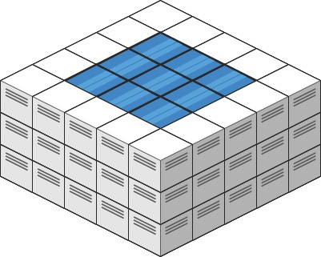

# PROBLEM STATEMENT

Given an m x n integer matrix heightMap representing the height of each unit cell in a 2D elevation map, return the volume of water it can trap after raining.

# EXAMPLE

    Input: heightMap = [[3,3,3,3,3],[3,2,2,2,3],[3,2,1,2,3],[3,2,2,2,3],[3,3,3,3,3]]

    Output: 10

# **WHY "TRAPPING RAIN WATER" APPROACH FAILS?**

Like almost everyone, my very first thought was to use the same logic as for - [42. Trapping Rain Water](https://leetcode.com/problems/trapping-rain-water/)

In case of [42. Trapping Rain Water](https://leetcode.com/problems/trapping-rain-water/), we had a 1-D list and we were asked to find how much water each block is able to store.

So, the approach was pretty straightforward as all we have to do was find the maximum height on the left, the maximum height on the right, and then just do -

		Water trapped above a block = Minimum of (max on left, max on right) - height of the block
		
Here, we are given a 2-D list or a matrix and we are asked the same question. That is, how much water can be trapped.

So, we might think that since it is a 2-D matrix, we can simply find the maximum on left, maximum on right, maximum on top and maximum on bottom for each cell and then simply do -

	Water trapped above a cell = Minimum of (max on left, max on right, max on top, max on bottom) - height of the cell
	
But, this is not a correct solution.

To understand this, we need to take a different example than the one given in the problem.

Let's say we have the following matrix - 

		2 1 2 1 2 
		2 1 1 1 2
		2 1 2 1 2
		
Now, if we use the same approach as Trapping Rain Water problem, 

	For cell at (1,2) with height = 1,
	
		max height on top = 2
		max height on bottom = 2
		max height on left = 2
		max height on right = 2
		
	So, water stored should be Min (2,2,2,2) - 1
	
	That is, 1 unit.
	
But, that is not correct. Why? 

Because, if there is one unit of water on the cell at (1,2), then because its left and right cells are also having the same height, the water will flow towards one of those. Let's say it flows towards the left cell that is, the one at (1,1).

Now, from this cell, the water can again flow towards top or bottom because on top and bottom, both cells have same height.

And in this way, the water will flow out of the matrix.

In other words, the cell at (1,2) simply cannot trap any water at all! 

And that's why the solution that we wrote for "Trapping Rain Water" will not work for this problem.

# **THE BOUNDARY & ITS ROLE IN TRAPPING WATER**

To hold water in any cell, there needs to be a boundary around it that has all the cells with a higher height. And if this is not easy to imagine, take a look at  the image in the second example - 

The only reason why water is stored in those cells is because the boundary around them has all the cells with larger heights. If even a single cell has a smaller or equal height than the cell in between (where water is stored), the water will flow out.

The matrix for the above image is 

	[[3,3,3,3,3],[3,2,2,2,3],[3,2,1,2,3],[3,2,2,2,3],[3,3,3,3,3]]
	
	So you can see that all the cells in the outer boundary have a height "3" 
	and "3" is greater than the height of all the nine cells between the boundary.
	
	And so total water stored = 10
	
	But, let's just change one boundary cell's height to "2"

	
Now, you will see that the total water that can be stored reduces to just 1 unit.
	
Why? Because all the water that we were able to previously store above all the cells with height = 2 now overflows because there is a boundary cell that has the same height. So, only 1 unit of water can be stored and that's above the cell with the height = 1.

And that's how this trapping of water works in this matrix.
		
# THE APPROACH
So, we at least understand by now that the boundary cells have a big role to play in finding out the amount of water that can be trapped above a cell.

Let's take a simpler example to understand the approach - 

	2 1 2 1 2 
    2 1 1 1 2
    2 1 2 1 2
	
These are positions of the boundary cells - (0,0), (0,1), (0,2), (0,3), (0,4), (2,0), (2,1), (2,2), (2,3), (2,4), (1,0), (2,0), (1,4), (2,4)

And no matter how big or small the matrix is, the boundary cells will never be able to trap any water above them. Because it will flow out.

So, the only cells that may hold water are the ones between this outermost boundary.

Now, as we did in above example, we will pick the cell with the smallest height among all these.

It is very important to understand why we pick the smallest first. Because this is a boundary, if the smallest cell does not allow water to flow outside (the water that's trapped above the inner cells), no other boundary cell will allow that because all others have a greater height.

So, it is easier to move foward if we start with the boundary cell with the smallest height first.

Okay, since there are a lot of cells with height = 1 among the boundary cells, let's choose any random one. For example, the cell at (0,1)

	2 1 2 1 2 
    2 1 1 1 2
    2 1 2 1 2

	Now, what are the neighbors of this cell? 
	
	Any cell in a matrix will have at most 4 neighbors - left, right, top and bottom.
	
	For the cell (0,1), there are only three valid neighbors -> (0,0), (0,2), and (1,1)
	
	Now, among these (0,0) and (0,2) are already boundary cells which means no water can be trapped by them.
	
	So, the only cell that we have to check is (1,1)
	
So, how do we check if a cell can trap water and it will not flow out via the boundary cell?

Well, its pretty easy. If the boundary cell has a greater height than the cell at which we want to trap water, then the water will be trapped. Otherwise, it is not possible to trap water at that position.

Here, the boundary cell (0,0) has a height = 1, and the cell that we are checking (1,1) also has a height = 1

And so, it means, the cell at (1,1) can never trap any water above it because it will flow out via the cell (0,0). So, the amount of water trapped is still 0. 

Next, we again need to pick the next smallest boundary cell height. 

So now, you can see that here, we can take help of a data structure named "HEAP". And more precisely, a "MIN HEAP". Because if we put all the boundary cells with their heights in this Min Heap, it will always have the boundary cell that has the least height among all on the top.
		
Hence, initially, we will push all the boundary cells in a minHeap and order them by their heights.

Coming back to our example, 
		
	2 1 2 1 2 
    2 1 1 1 2
    2 1 2 1 2
	
	Since we already figured out that cell (1,1) cannot hold any water, is this of any use anymore?
	
	Well, yes! Since it is a matrix,
	there will be boundary inside a boundary inside a boundary, 
	until we reach the middle of the matrix.
	

The above image shows the same example as in the problem. So, we can see that there is the outermost boundary, shown by the red line. Then, there is another boundary inside, shown by the white line. 

	So the idea is that, it doesn't matter if some cell can or cannot hold water.
	It might be a boundary cell for some inner cell. 
	
	Hence, we do not want to just discard it once we checked it.
	
	So, for each cell we check, we will put it into the minHeap.
	
	And the height will depend on whether we were able to store water or not above this cell.
	
	If we were not, then the height remains the same as before.
	
	But if we were able to store some water, then the height will become same as the boundary cell's height.
	
It might be confusing to understand at first, but it is super simple to understand with an image. So, let's take the same image as the example in the problem - 

You see, all the boundary cells have a height = 3. So, let's take any one of these. Now, if you check its neighboring cell which has some water, then its height now (including the water it has trapped) has become same as the height of the boundary cell. It means, for any inner cell for which it is a boundary cell, we won't consider its height as what the input matrix has. Instead, we will consider its height as (initial height + water trapped).

To understand it better, take another example - 

	2 1 2 1 2 
    2 0 1 1 2
    2 1 2 1 2

See, the cell at (0,1) is a boundary cell and its neighbor is below it at (1,1) with height = 0

Since height of (1,1) < height of (0,1), it means (1,1) can trap 1 - 0 => 1 unit of water above it.

Now, (1,1) is a boundary cell for the cell (1,2) as well. But now that it also has 1 unit of water above it, it means, now this boundary cell (1,1) has a height => 0 + 1 => 1. That is, initial height + water trapped.

If no water was trapped, then there would not be any change in the height.

And the last piece of the puzzle is to keep track of all the cells that we have already checked. Because, if one cell is a neighor or some other cell, then it can also be a neighbor of more cells since this is a matrix. And if we already checked a cell, why we have to again do the same thing with it? That's why, we can use a "Set" to keep track of all the cells that we have already checked so that we do not visit them again and it will save a lot of time.