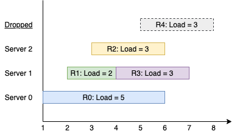

You have k servers numbered from 0 to k-1 that are being used to handle multiple requests simultaneously. Each server has infinite computational capacity but cannot handle more than one request at a time. The requests are assigned to servers according to a specific algorithm:

 - The ith (0-indexed) request arrives.
 - If all servers are busy, the request is dropped (not handled at all).
 - If the (i % k)th server is available, assign the request to that server.
 - Otherwise, assign the request to the next available server (wrapping around the list of servers and starting from 0 if necessary). For example, if the ith server is busy, try to assign the request to the (i+1)th server, then the (i+2)th server, and so on.
  
You are given a strictly increasing array arrival of positive integers, where arrival[i] represents the arrival time of the ith request, and another array load, where load[i] represents the load of the ith request (the time it takes to complete). Your goal is to find the busiest server(s). A server is considered busiest if it handled the most number of requests successfully among all the servers.

Return a list containing the IDs (0-indexed) of the busiest server(s). You may return the IDs in any order.

# EXAMPLE

    Input: k = 3, arrival = [1,2,3,4,5], load = [5,2,3,3,3] 
    Output: [1] 

Explanation: 
All of the servers start out available.
The first 3 requests are handled by the first 3 servers in order.
Request 3 comes in. Server 0 is busy, so it's assigned to the next available server, which is 1.
Request 4 comes in. It cannot be handled since all servers are busy, so it is dropped.
Servers 0 and 2 handled one request each, while server 1 handled two requests. Hence server 1 is the busiest server.

# **APPROACH 1 - TLE**

Before explaining the accepted solution, let me share the solution which I initially wrote and which gave TLE. This solution was passing 105/108 test cases.

Basically, if you ignore the condition that says the "i % k" server is the most optimal server for a request "i", then this problem because very simple. Because now, all we need to do is simulate the whole process using two heaps, one will have all the available servers, and the other will have all the busy servers.

All the available servers will be ordered by their indices from smallest to largest, and the busy servers will be ordered by the time at which they will again be available. And this order will be from smallest to longest time.

So basically, both these will be MIN HEAPS.

For every new request that comes at a time "x", we will check if among the busy servers, there are some servers that are now available. That will be the case if the time at which they are available is <= "x". If that is true, we will move them back to the available servers heap.

And in this way, we process the requests.

But then, we have an extra condition in this problem that says for a requests "i", the most optimal server that will pick that request is "i % k". If that server is not available, then the next most optimal server is "i % k" + 1 and so on till we reach the last server. If we still cannot find an optimal server, then we will start looking at available servers starting from server 0.

So, one way can be to maintain a set of available servers so that at any time, we can check if "i%k" is in the set or not. If yes, then good. If not, then we can check if "i % k"+ 1 is in the set or not. And we keep doing it until we reach the end.

And if we still cannot find a server, we then simply assign the request to the available server with the smallest index, that is, the top of the MIN HEAP.

But, this extra step of checking if optimal servers are available or not takes some extra time, and for large test cases, this will result in TLE. We need a more efficient way to find the most optimal server, instead of having to do a linear search.

# **APPROACH 2 - SORTED LIST + BINARY SEARCH**

Since a linear search is not a good approach, a better way is to do a Binary Search.

But, for Binary Search, the available servers need to be in a Sorted Order. And well, we cannot sort the list of available servers each time a new server gets added. But, we can use something that takes care of sorting. No, it is not a HEAP. It is a "SORTED LIST". Why not a Heap? Because while a Heap will take care of sorting, if we have to remove something from heap that is not on top, the worst case time complexity in that case if O(N). But, if we have a Sorted List, no matter from which index we remove an item, the time complexity is approximately O(LogN).

And so, for the available servers, we will use a Sorted List. In this way, there is no way to have an extra set as well.

The whole logic remains almost the same, except that to find the most optimal server, we use Binary Search.

We know that for a request "i", the most optimal server is "i % k". If that is not available then it is "i % k" + 1 and so on..

In simple words, for a request "i", the most optimal server is the one that has an index closest to the "i % k" index. In other words, the leftmost server in the "availableServers" list that has index >= i % k. And well, that's exactly what we will find using Binary Search.

If we cannot find one, it simply means, we can now pick the server with the smallest index in the available servers. That is, the first server in this list (since the list is always in a sorted order).

And well, that's it. That's the whole approach.