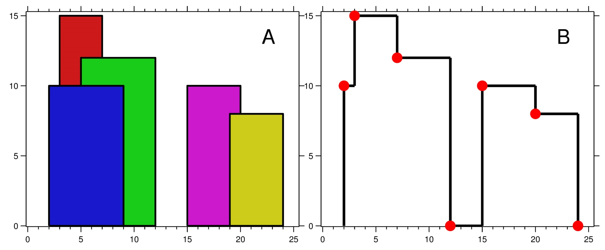

# PROBLEM STATEMENT

A city's skyline is the outer contour of the silhouette formed by all the buildings in that city when viewed from a distance. Given the locations and heights of all the buildings, return the skyline formed by these buildings collectively.

The geometric information of each building is given in the array buildings where buildings[i] = [lefti, righti, heighti]:

 - lefti is the x coordinate of the left edge of the ith building.
 - righti is the x coordinate of the right edge of the ith building.
 - heighti is the height of the ith building.

You may assume all buildings are perfect rectangles grounded on an absolutely flat surface at height 0.

The skyline should be represented as a list of "key points" sorted by their x-coordinate in the form [[x1,y1],[x2,y2],...]. Each key point is the left endpoint of some horizontal segment in the skyline except the last point in the list, which always has a y-coordinate 0 and is used to mark the skyline's termination where the rightmost building ends. Any ground between the leftmost and rightmost buildings should be part of the skyline's contour.

Note: There must be no consecutive horizontal lines of equal height in the output skyline. For instance, [...,[2 3],[4 5],[7 5],[11 5],[12 7],...] is not acceptable; the three lines of height 5 should be merged into one in the final output as such: [...,[2 3],[4 5],[12 7],...]

# EXAMPLE

    Input: buildings = [[2,9,10],[3,7,15],[5,12,12],[15,20,10],[19,24,8]]

    Output: [[2,10],[3,15],[7,12],[12,0],[15,10],[20,8],[24,0]]

Explanation:
Figure A shows the buildings of the input.
Figure B shows the skyline formed by those buildings. The red points in figure B represent the key points in the output list.

# APPROACH

This is a pretty good video I found on this problem - https://youtu.be/GSBLe8cKu0s

Let's understand the basic idea of the solution using an example.

buildings = [[2,9,10],[3,7,15],[5,12,12],[15,20,10],[19,24,8]]
	
	
One thing that is not hard to figure out is that, All the points in the final output list denote those places, where the height changes. 

	Initially, maximum height of a building was 0 but as soon as we reached the point "2" on the x-axis, 
	the maximum height increased to 10.
	
	So, in output list, we added (2,10)
	
	Then, when we reached the point "3" on the x-axis, the maximum height increased to 15
	
	So, in output list, we added (3,15)
	
	Now, at the point "5" on x-axis, the height changed to 12 
	but it did not increase the maximum height so far. The maximum height still remained 15 only.
	
	And that's why, this point is not included in the output list.
	
	At point "7" on the x-axis, the red building ended. This means, at this point, the maximum height is no longer 15.
	The new maximum height at this point is "12".
	
	And that's why in output list, we added (7,12)
	
	Then, at the point "12" on x-axis, the green building also ended. This means the maximum height is no longer 12.
	And since "blue" building has already ended as well, it means now we are at a ground level.
	So, maximum height is reset to 0.
	
	And so, in output list, we added (12,0)
	
	At the point "15" on x-axis, the pink building starts and the height increased to 10 and this is also the new maximum height.
	So, in output list we added (15,10)
	
	Then at point "19" on x-axis the yellow building starts and it has height = 8. But, this is not the maximum height.
	So, nothing is added to output list.
	
	At the point "20" on x-axis, the pink building ended and so, maximum height is nol onger "10". Instead, it is now "8".
	
	Hence, in output, we added (20,8)
	
	And finally, we reach the point "24" on x-axis where the yellow building also ended.
	
	And so, the maximum height is again reset to 0.
	
	And so, in output, we added (24,0)
	
Now, from this, you can understand that we need to keep track of the maximum height so far and we also need a way to move to the next maximum height in case current maximum height is no longer valid. So, we need an ordered data structure that can give us the maximum height at any time. And well, we can use a MAX HEAP for this.

When a building starts, its height needs to be added to the maxHeap. But when it ends, it needs to be removed from the maxHeap.

But, one thing to note is that while removal from a MAX HEAP is O(1) if done from the top, it is not very efficienct if we try to remove some value from some other place than the top. That's why, when we have to remove some height (when building ends), we can save that height value in some dictionary with its count (count, becuase there can be multiple buildings with same height).  And then, we can remove those heights only when they appear on top of the heap. 

Another thing that can now be understood from above example is that we need to go over every "x" axis point, not just the "left" values. This was one mistake I was doing when I initially started writing a solution and failed. And we need to go over those values from left to right, in sorted order.

The last piece of the puzzle is how to decide what values to add into the output list.

So, from above example, we can conclude some things - 

	When it is the "left" of a building and the current maximum height is same as the building's height,
	then the value to be added will be (left,height)
	
	When it is the "right" of a building and the current maximum height has changed
	then the value to be added will be (left, new maximum height)
	
	When all buildings have ended and the heap is empty, it means we are at ground level.
	So, the value to be added will be 
	
And finally, do not forget the "NOTE" in the problem - **There must be no consecutive horizontal lines of equal height in the output skyline.**